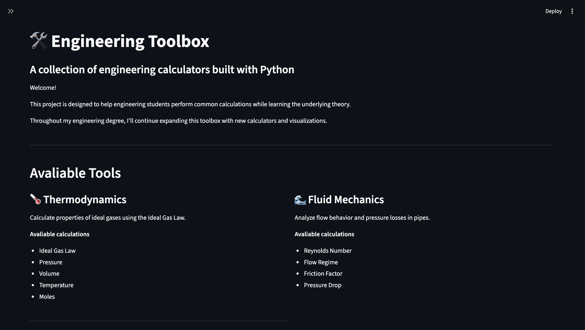

# EngineeringToolBox
A Python based engineering calculation and analysis toolkit built with Streamlit.

## Overview 
Engineering Toolbox is an interactive web application designed to perform common engineering calculations through a simple Streamlit interface. 

The project combines engineering theory with Python programming, data visualization, input validation, automated testing, and modular software design. 

## Features 

### Unit Conversion 
- Temperature conversion 
- Engineering unit conversions 

### Thermodynamics 
- Ideal Gas Law calculations 
- Pressure, volume, temperature, and mole relationships 

### Fluid Mechanics 
- Reynolds Number calculation 
- Flow regime classification 
- Reynolds Number visualization 
- Darcy-Weisbach pressure drop calculation 
- Darcy friction factor estimation
- Pipe roughness effects
- Pipe sizing

### Heat Transfer
- Conductive heat transfer
- Fourier's Law

## Software Features
- Interactive Streamlit interface
- Input validation 
- Error handling 
- Automated testing
- Modular Python calculation fuctions
- Interactive visualizations

## Engineering Calculations 

### Reynolds Number 
The Reynolds Number is calculated using: 
$$
Re = \frac{\rho v D}{\mu}
$$ 
where: 
- $\rho$ = Fluid density 
- $v$ = Fluid velocity 
- $D$ = Pipe diameter 
- $\mu$ = Dynamic viscosity

### Darcy-Weisbach Equation 
Pressure drop is calculated using: 
$$
\Delta P = 
f\frac{L}{D}
\frac{\rho v^2}{2}
$$

where: 
- $f$ = Darcy friction factor
- $L$ = Pipe length 
- $D$ = Pipe diameter\
- $\rho$ = Fluid density 
- $v$ = Fluid velocity

### Friction Factor 
For turbulent flow, the friction factor is determined using the pipe roughness and Reynolds Number. 
The toolbox uses the following relationship: 

$$
f =
\frac{0.25}
{\left[
    \log_{10}
    \left(
        \frac{\epsilon}{3.7D}
        +
        \frac{5.74}{Re^{0.9}}
        \right)
    \right]^2}
$$
Where: 
$f$ = Darcy friction factor
$\epsilon$ = absolute pipe roughness (m)
$D$ = pipe diameter (m)
$Re$ = Reynolds Number

### Conductive Heat Transfer
Heat transfer through a plane wall is calculated using Fourier's Law:

$$
Q = 
\frac{kA\Delta T}{L}
$$
Where:
- $Q$ = Heat transfer rate (W)
- $k$ = Thermal conductivity (W/m·K)
- $A$ = Heat transfer area (m²)
- $\Delta T$ = Temperature difference (K)
- $L$ = Material thickness (m)

### Pipe Sizing 
The pipe sizing tool uses an iterative design approach. Candidate pipe diameters are evaluated using: 

$$
Re = \frac{\rho vD}{\mu}
$$

Followed by the friction factor and Darcy-Weisbach equations: 
$$
\Delta P = 
f\frac{L}{D}
\frac{\rho v^2}{2}
$$

The smallest diameter satisfying the design constraint is selected: 
$$
\Delta P \leq \Delta P_{text{max}}
$$

Where: 
- $\Delta P$ = Calculated pressure drop 
- $\Delta P_$ = Maximum allowable pressure drop

## Technologies
- Python 
- Streamlit
- NumPy 
- Matplotlib 
- Pytest
- Git
- Github

## project Structure

Engineering Tool Box/
- app.py
-  calculators/
    - ideal_gas.py
    -  pipe_flow.py
    - pressure_drop.py
    - heat_transfer.py
    - pipe_sizing.py
- tests/
    - test_pressure_drop.py
    - test_heat_transfer.py
    - test_pipe_sizing.py
- utils/ 
    - layout.py
    - unit_conversions.py
- .gitignore
- requirements.txt
- README.md

## How to Run 

### 1. Clone the repository
git clone https://github.com/aileenfeng13-web/EngineeringToolBox.git 

### 2. Navigate to the project 
cd EngineeringToolBox 

### 3. Create a virtual environment 
puthon -m venv.venv

### 4. Activate the virtual environment 
On macOS/Linux: 
source .venv/bin/activate

### 5. Install dependencies 
pip install -r requirements.txt 

### 6. Run the application 
streamlit run app.py

## Testing 
Automated tests are written using Pytest. 
Run the test suite with: 
python -m pytest

## Learning Goals 
This project was developed to strengthen my skills in: 
- Python programming 
- Chemical engineering calculations
- Fluid mechanics 
- Data visualization 
- Numerical analysis 
- Software testing  
- Git and GitHub
- Modular software design
- Technical documentation

## Future Improvements 
- More automated tests 
- More interactive visualizations 
- Additional thermodynamics calculations
